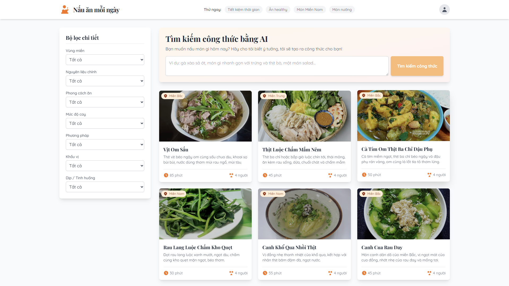

# Nấu Ăn Mỗi Ngày

**AI Culinary Companion - Trợ lý nấu ăn thông minh với công nghệ AI**

Ứng dụng web hiện đại giúp bạn khám phá và tìm kiếm công thức nấu ăn Việt Nam một cách nhanh chóng và thuận tiện. Tích hợp Google Gemini AI để tạo công thức nấu ăn tùy chỉnh theo nhu cầu của bạn.

---

## ✨ Tính Năng Nổi Bật

### Tìm kiếm thông minh
Tìm kiếm công thức nấu ăn theo tên món, nguyên liệu, độ khó, thời gian nấu và nhiều tiêu chí khác.

### AI Recipe Generator
Tạo công thức nấu ăn mới với Google Gemini AI - chỉ cần mô tả món bạn muốn nấu, AI sẽ tạo công thức chi tiết cho bạn.

### Lọc đa tiêu chí
- **Thời gian nấu**: Nhanh (< 30 phút), Trung bình (30-60 phút), Lâu (> 60 phút)
- **Độ khó**: Dễ, Trung bình, Khó
- **Danh mục**: Món chính, Món phụ, Tráng miệng, Đồ uống
- **Khẩu phần**: 1-2 người, 3-4 người, 5+ người
- **Chế độ ăn**: Ăn chay, Ăn kiêng, Không gluten, v.v.

### Giao diện thân thiện
- Responsive design - hoạt động mượt mà trên mọi thiết bị
- Sidebar filter cho desktop
- Modal filter cho mobile
- Chi tiết công thức đầy đủ với ảnh minh họa

### Gợi ý thông minh
Các tag gợi ý nhanh giúp bạn khám phá món ăn theo xu hướng: Món chay, Món nhanh, Món ăn sáng, v.v.

---

##  Công Nghệ Sử Dụng

### Frontend
- **Framework**: React 19.2.0
- **Language**: TypeScript
- **Build Tool**: Vite 6.2.0
- **Styling**: TailwindCSS (CDN)
- **Fonts**: Quicksand, Playfair Display

### AI Integration
- **AI Platform**: Google Gemini 2.5-flash
- **SDK**: @google/generative-ai 1.28.0
- **Features**: Recipe generation with structured output

### Data Management
- **Mock Data**: 101 công thức nấu ăn Việt Nam
- **Image Hosting**: GitHub Raw URLs
- **State**: React Hooks (useState)

